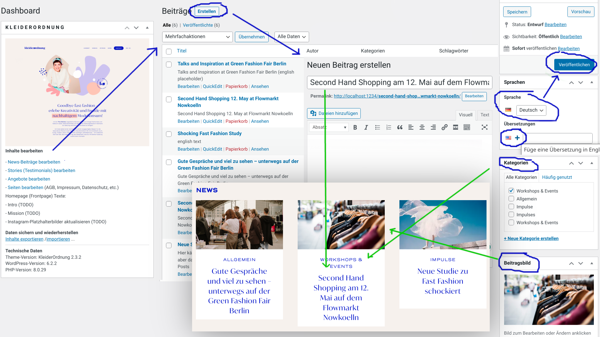

# KleiderOrdnung Berlin

A portfolio website for sustainable stylist Tina Steinke in Berlin,
following up on a previous sustainable style consultancy in Düsseldorf.
Visual design by [Ina Nixdorf](https://www.inanixdorf.de/), technical concept and development by [Ingo Steinke](https://www.ingo-steinke.de/).

- https://kleiderordnung.berlin/ (upcoming)
- https://www.kleiderordnung-berlin.de/ (classic alternative)

Local development: http://localhost:1234/
Backend: http://localhost:1234/wp-admin (default credentials: admin:secret).
Make sure to that the theme KleiderOrdnung got activated or activate it manually after installation.

Features:
- accessible: WCAG 2.0 compliant, tab-navigateable, high contrast
- animated using subtle micro-animations and scrolling effects
- beautiful: web design based on the visual corporate identity
- classic: hybrid theme with custom post types, custom fields, and block editor support
- documented: README for developers and an additional manual for website owners
- editable: content, images, and translations can be edited by the site owner
- international: localized by a professional translator and proofreader
- minimal: all important content at a glance on one landing page
- portable: theme, plugins, and content can be moved from server to server
- printable: distinct style sheet to ensure print / PDF layout
- quick: cacheable and without loading unnecessary data
- responsive: designed and tested to work on any device and browser
- semantic: meaningful markup to ensure technical search engine optimization
- tested: automated and manual frontend tests plus static code analysis
- versioned: open source development on GitHub


## Installation / Deployment

To setup / deploy KleiderOrdnung on a website,
- install WordPress core and the required plugins,
- copy all `wp-content/mu-plugins/*.php` files manually,
- [setup Polylang](https://polylang.pro/doc/multilingual-custom-post-types-and-taxonomies/):
  - German (Deutsch) as default language
  - English (EN-US) as additional language
  - enable translation of custom post types (Languages/Sprachen -> Settings/Einstellungen -> Custom Post Types and Taxonomies / Benutzerdefinierte Inhaltstypen und Taxonomien -> check all checkboxes) _before_ adding (or importing) content!
- install the lastest KleiderOrdnung theme by uploading it in WP-Admin,
- activate the theme,
- copy all icons and manifest files (`*.ico`, `*.png`, `*.svg`, `*.json`, `*.xml`, `robots.txt`) to the web root directory
- configure server and caching by editing `.htaccess` / `nginx.conf` / hosting backend or by using appropriate plugins,
- use additional reverse proxy and/or CDN servers if necessary,
- run automated tests (`npm run test`) and update the baseline screenshots if necessary (see [Testing...](#testing]))
- test everything and back up your data regularly! (Werkzeuge -> Export or use a plugin like [Updraft Plus](https://wordpress.org/plugins/updraftplus/)

## User Manual for the Site Owner(s)

There is a (German) end-user manual aiming to show non-technical site owners how to edit and add content in the WordPress admin backend, available at [doc/anleitung.md](doc/anleitung.md) and linked from the custom admin dashboard widget which contains direct links to edit different custom content types and generate a content export file.

### Manual Screenshots

Add, edit and preview news (blog posts):


Add, edit and preview stories (testimonials):


Add, edit and preview offers:


Edit frontpage contents:


Flamingo message inbox:


Contact Form 7 settings:


Update WordPress / plugins:


Clear cache:


Colors to distinguish between local host, preview and production servers:


## Data Flow, Backups, Updates

Design and behavior is controlled by the theme and plugins which can be deployed to production after testing. Content (data) is edited on the production server and synchronized back to test and development systems.

[]()

Upload
 - the theme (ZIP) via wp-admin
 - the `mu-plugins` via (S)FTP (**NOT included in the theme file!**)

Download
 - `content.xml` via WordPress tools export / import

Existing posts and pages will be replaced when importing. This is non-standard configured behavior which will only work if `mu-plugins/wordpress-import-update.php` is present!

DON'T commit any personal data (possibly included in a complete "all content" export file). Make sure to review and clean up any `content.xml` before committing!

Review and synchronize settings manually, as far as you find useful. Make sure that all necessary plugins are installed.

## Setup, Structure, Editing

The portfolio website content can be edited and extended using the WordPress admin backend. This is a classic WordPress theme, without full-page editing or full theme engine support, but allowing to use the block editor where it might be helfpul.

The page structure and design elements are fixed by the theme, based on the main landing page
which can not be fully edited in the block editor. Instead, custom fields or widgets are provided to ensure
non-destructive editing limited to the intended content type (plain text or rich text with limited markup options).

### Content: Widgets, Custom Fields and Post Types

- **page** (front / home / landing page, imprint, privacy, about me)
  - The main index landing page (front page / home page), defined in `front-page.php` according to the class [template hierarchy](https://developer.wordpress.org/themes/basics/template-hierarchy/), contains most of the content and links / teasers to additional posts and pages.
  - Text lines and paragraphs must be editable, probably as **custom fields**, using either plain text or very limited styling like bold, italic, underline, marker, link:
    - `page_intro_headline`
    - `page_intro_text`
    - `page_mission_headline`
    - `page_mission_text`
    - `page_cta_text`
    - `page_contact_teaser_text`
    - `page_contact_job_title`
  - Any other regular static page, like **privacy**, **imprint**, **TOS** (AGB), is displayed by `page.php` and edited in the block editor.
- **post** (**News** blog posts / teasers)
  - category title = over headline
  - post title = teaser headline / text
  - post image = main post image
- **story** (**Stories** / Testimonials) _localized_
  - post title = headline: testimonial name and short description
  - post text = quotation
  - post image(s) = main image (and possibly more optional images)
  - **position_number** (text) in `story_field_group` (sidebar)
- **offer** (**Angebot**) _localized_
  - post title = main headline
  - post image = main post image (only in main offer section)
  - post text = intro text
  - **offer_features** ("Was du erhältst") (text) in `offer_field_group_main`
  - **offer_price** (text) in `offer_field_group_main`
  - **offer_price_annotation** (text) in `offer_field_group_main`
  - **offer__id** (text)  in `offer_field_group_sidebar`
  - **offer_position_number** (text) in `offer_field_group_sidebar`
  - custom taxonomy: **offer_section** _NOT localized_
    - `angebot` ("Angebot")
    - `weitere` ("Weiteres Angebot")
- general **translations** managed by Polylang, like messages and button captions can be edited by the site owner on the **languages** -> **translations** page.
- social media placeholders (see below)
- content handled by plugins or widgets:
  - Instagram section (external feed via juicer.io)
  - contact form (widget shortcode)
  - carbon badge (external content)

##### Contact Forms

There must be exactly 1 active contact form for each language. The form titles must contain the language string ("en_US" or "de_DE"), so the theme can display the correct contact form dynamically without hard-coded form IDs, to work around the problem that contact form 7 posts won't be translated by the current Polylang plugin.

##### Polylang Localization Settings for Custom Post Types

Localization / translation needs to be enabled explicitly in Polylang **Languages** -> **Settings** -> Custom Post Types and Taxonomies:

- [x] Stories (Testimonials) (story)
- [x] Angebote (offer)
- [ ] Angebotskategorien (offer_section)

##### Post and Field Types, Sorting Order

Pragmatically working around Meta Query issues when using custom post types, custom ACF fields, and polylang translation in the same theme, all custom fields are text fields. Custom **position number** fields are simple tools to let site owners control the display order of items that are not sorted by date.

##### Offer ID and Taxonomy

Each offer should have a unique, permanent ID, used as an anchor for sub-navigation and for external **deep linking**. The offers and their IDs should also match the checkbox options in the contact form. **Icons** on top of the offer cards are displayed according to one of the known offer IDs.

Offer taxonomies currently serve to separate main offers, displayed with cards and images, from "other offers". There is no point in localization / translation.

**Angebot** is not called "product" to avoid conflict with optional shop plugins.

#### Front Page Structure

- Header: the (sticky) header bar with logo and main navigation
- Main:
  - Intro Section
    - Key Visual (hero image / hero header / jumbotron)
    - Key Headline (h1)
    - Text Paragraph
  - Offers Section (h2)
    - sub-navigation
    - offer article (post) (detailed, featured, main)
      as a WordPress (custom) post, marked up as an &lt;article&gt;
      with image, main headline (h3), text paragraphs, offer price etc.
    - (alternative further offers in a smaller card layout)
  - page decoration elements / section decoration elements
  - Mission Section
  - Stories Section
    - story block quotes with icon, headline, paragraph
  - News Section with text box, call to action text, button
  - Social Media Section: Instagram images and link
  - Contact Section
    - contact information (vcard)
    - contact form
- Footer

#### Common Elements

- Buttons (and call-to-action links in a button-like appearance)
- Links (in a text-like appearance)
- Headlines, bold text, and other typographic elements
- Carousels or similar draggable / slideable elements
- Decoration + Perspective Effects
- Lists
- Icons
- Card-like grid / flex layouts

- **page header**
- **Instagram posts**
- **contact form**
- **page footer**


### Decoration / Parallax Perspective Effects

Colorful shapes are placed behind content sections using mixins and custom properties defined in `a_decoration.css`. Scale and height adjustment property defaults can be overridden in a module / section scope, which might in turn be ajusted according to a JavaScript-based height measurement once after the document has been rendered.

### Contact Form, Social Media, Dynamic Menu

A contact form is provided using the popular Contact Form 7 plugin and the Flamingo add-on to save messages in the database. For localized content, a new form needs to be created for each language.

Contact form settings use specific shortcodes, identifiers must match in form template, email template, style sheets, and possible JavaScript handlers. Checkbox elements show up with their value when checked.

Example:

Form markup:

``` 
<div class="contact__fieldset contact__fieldset--from">
  <label class="contact__label contact__label--name"> <span class="screen-reader-text">Dein Name</span> [text* Name autocomplete:name akismet:author placeholder "Name"] </label><!-- NO LINE-BREAK HERE ! --><label class="contact__label contact__label--email"> <span class="screen-reader-text">Deine E-Mail-Adresse </span> [email* Email autocomplete:email akismet:author_email placeholder "E-Mail"] </label>
</div>

<div class="contact__fieldset contact__fieldset--message"><label class="contact__label contact__label--nachricht"> <span class="screen-reader-text">Deine Nachricht (optional)</span> [textarea Nachricht placeholder "Deine Nachricht"] </label></div>

<div class="contact__fieldset contact__fieldset--checkboxes">
  <div class="contact__calltoactiontext--fieldset">Unverbindliche Anfrage für</div>

  [checkbox anfrage-style-visit id:anfrage-style-visit class:contact__checkboxline class:contact__checkboxline--style-visit use_label_element "Style Visit"]

  [checkbox anfrage-shopping-tour id:anfrage-shopping-tour class:contact__checkboxline class:contact__checkboxline--shopping-tour use_label_element "Shopping Tour"]

  [checkbox anfrage-online-style-beratung id:anfrage-online-style-beratung class:contact__checkboxline class:contact__checkboxline--online-style-beratung use_label_element "Online Styling Beratung"]

  [checkbox anfrage-start-up-consulting id:anfrage-start-up-consulting class:contact__checkboxline class:contact__checkboxline--start-up-consulting use_label_element "Start-Up-Consulting"]

  [checkbox anfrage-gutschein id:anfrage-gutschein class:contact__checkboxline class:contact__checkboxline--gutschein use_label_element "Gutschein"]

  [checkbox anfrage-ordnung-im-schrank id:anfrage-ordnung-im-schrank class:contact__checkboxline class:contact__checkboxline--ordnung-im-schrank use_label_element "Ordnung im Schrank"]

  [checkbox anfrage-styling-abo id:anfrage-styling-abo class:contact__checkboxline class:contact__checkboxline--styling-abo use_label_element "Styling-Abo"]
</div>

<span class="contact__buttonwrapper contact__buttonwrapper--submit">[submit "Absenden"]</span>
```

Email template:

```
Subject: [_site_title] Kontaktformular
Additional header: Reply-To: [Email]
Message text:

Von: [Name]
E-Mail: [Email]

Unverbindliche Anfrage für: [anfrage-style-visit] [anfrage-shopping-tour] [anfrage-online-style-beratung] [anfrage-start-up-consulting] [anfrage-gutschein] [anfrage-ordnung-im-schrank] [anfrage-styling-abo]

Nachricht:
[Nachricht]

-- 
Diese E-Mail wurde von einem Kontaktformular von [_site_title] ([_site_url]) gesendet
```

#### Instagram Feed via Juicer

- Known issues:
  - "juicer error" when using on localhost instead of configured domain or pseduo-public domain like browserstack's bs-local.com
  - expired API connection prevents updating new Instagram content
- account / API:
  - Tina's Google account logs into juicer.io
  - which has been connected to her Instagram account
    while logged in to juicer, Google, and Instagram on the same browser

- placholder content:

Unless a new page visitor has given consent to loading Instagram data by clicking on "allow once" or "allow always", placeholder images will be shown. This is currently 1 single image, consisting of a cropped region of the 5 latest feed images shown by juicer in the context of the production or preview page.

If the placeholder image does not update automatically, replace the placeholder image by overwriting
`/img/instagram/preview5xinsta-20230601.jpg`
with an updated image file in the following aspect ratio: width="1857" height="463"

TODO: alternatively:

The update process might be (partially) automated or facilitated using the [Screen Capture API](https://developer.mozilla.org/en-US/docs/Web/API/Screen_Capture_API).

### Localization

The site is provided in a German and an English language version using the Polylang plugin. Multilingual content has been described in the content section above. Theme-specific language strings can be created (or updated) using PO(T)/MO files [as explained in the WordPress codex](https://developer.wordpress.org/apis/internationalization/localization/):


So we would either 

#### use wp-cli:

enter the `wp_cli` or `wordpress` container:
```
docker-exec -it kleiderordnung-berlin_wordpress_1 bash
```

then, inside the container, (install and) run `wp` cli to create language files:

```
wp i18n make-pot wp-content/themes/kleiderordnung
```

or

#### use the free graphical Poedit application

which is an open source tool for all major OS.  If you don’t have the pro version you can easily get the [Blank POT](https://github.com/fxbenard/Blank-WordPress-Pot) by Fx Bénard and use that as the base of your POT file. Once you have placed the blank POT in the languages folder you can click “Update” in Poedit to update the POT file with your strings.

#### POT to PO to MO

POT files contain the original strings (usually in English, but here German is the default language). "Very long strings" are split into multiple lines (by PoEdit and/or [gettext](https://en.wikipedia.org/wiki/Gettext), often starting with an empty string "for better alignment", but that's equivalent to using long one-line strings.

**Translation / internationalization (i10n):** take the `.pot` file and translate the `msgstr` sections into the respective language(s). The result is a `.po` file for each langauge with the same format as a `.pot`, but with translations and some specific headers.

Use the official WordPress locale strings (with **underscores**, not hyphens). For example, the locale for German is `de_DE`, and our theme's text domain is `kleiderordnung`, therefore the German MO and PO files could be named `kleiderordnung-de_DE.mo` and `kleiderordnung-de_DE.po`, but that's misleading. When placed inside the **theme's language folder** (not the WordPress instance's language folder) we must omit the (redundant) theme name (text domain) in the file name.

So we will have:
- `src/languages/en_US.mo` -> `themes/kleiderordnung/languages/en_US.mo`
- `src/languages/en_US.po` -> `themes/kleiderordnung/languages/en_US.po`
- `src/languages/de_DE.mo` -> `themes/kleiderordnung/languages/de_DE.mo`
- `src/languages/de_DE.po` -> `themes/kleiderordnung/languages/de_DE.po`

This will match the content language in the `<html lang` attribute where a hyphen is used instead of the underscore.

```
<html lang="en-US"
```

This will also match the necessary explicit loading command in `functions.php`:

```php
add_action('after_setup_theme', function() {
load_theme_textdomain( 'kleiderordnung', get_template_directory() . '/languages' );
```

**Generate / update `.mo` files** from `.po` files: the program `msgfmt` (part of the `gettext` package) can be used on the command line to create the MO file. A typical `msgfmt` command looks like this:

```
msgfmt -o src/languages/en_US.mo src/languages/en_US.po
msgfmt -o src/languages/de_DE.mo src/languages/de_DE.po
```

You can use the prepared build target `build:translations` to update the `.mo` files.

`npm run build:translations`

Sources:

- https://developer.wordpress.org/apis/internationalization/localization/
- https://polylang.pro/doc/theme-internationalization-and-localization/
- https://polylang.pro/doc/import-and-export-strings-translations/
- https://github.com/izimobil/polib/issues/96

### Don't Prevent Caching!

Polylang settings offer automatic redirection to page content based on browser language and preventing caching the front page. As we absolutely want to cache static content to prevent costly and redundant recreation of content on the server side and speed up loading time for clients, this option must not be used!

Automatic detection and redirection can be done alternatively using client-side JavaScript or relying on matching search engine results etc.

## Theme and Design

The theme is a standalone theme not depending on any parent theme, but inspired by existing themes like
Twenty-Twenty-Three, GeneratePress, and Fasto. This is a classic theme with partial block editor support.

The graphic design has been conceived in collaboration with Ina Nixdorf and Martina Steinke.
Technical details and development: Ingo Steinke.
Support and code review: tbd.

### Web Fonts
- Henderson Sans by [Sudtipos](https://www.sudtipos.com/)
- Ivy Mode by Jan Maack from [Ivy Foundry](https://typenetwork.com/type-foundries/ivy-foundry).

<a name="testing" id="testing"></a>
## Development, Performance, Accessibility, and Testing

Edit source code in `src` files, rebuild and test the theme using `npm run build` and `npm run build:zip`, then start http://localhost:1234/

Increase theme versions in

- `src/style.css`: `Version:`,
- `src/functions.php`: `define( 'KLEIDERORDNUNG_THEME_VERSION`,
- `package.json`: `"version":`

The web site's theme, plugin, and example content can be developed and testing using automated screenshot tests, accessibility and performance audits with axe and Lighthouse, and static code quality assistance using eslint, stylelint, SonarLint.

We can use exported (Figma) template graphics instead of screenshots to verify the initial visual expectations.

[CodeceptJS](https://codecept.io/) is used for test automation.

WordPress can be run locally using the provided development server setup using Doker and docker-compose, based on [wp_template_opinionated](https://github.com/openmindculture/wp_template_opinionated/) by [Ingo Steinke](https://www.ingo-steinke.com/).

The theme bundle and client-side CSS will be built (without SCSS) using PostCSS. Supported upcoming CSS features include imports, custom properties, and native nesting.

The local development setup has been tested on Ubuntu Linux and _should_ work on Windows and MacOS as well. If it doesn't, and the exported CSS and theme files are modified, or if any upcoming WordPress editing features override theme declarations or template parts, those changes should be ported back to the theme source code immediately!

Code style follows modern recommendations for HTML, CSS, PHP, and ECMAScript, ignoring the divergent WordPress community guidelines.

## Verify and Customize Users and Dashboard Widgets

Create a new user as an author or a more appropriate [WordPress admin role](https://wordpress.org/documentation/article/roles-and-capabilities/)) (permission group).

Log in to your Dashboard as the new user. On the screen showing the "Site Health" widget, click the "Screen Options" ("Ansicht anpassen") menu item at the top right of your screen and move the custom theme widget to the top position. You can turn off "Site Health" and any other widgets you don't want to see.

This is a per-user function, therefore turning it off only removes it for you and not other users.

### Make sure the website owner can actually edit their content!

If the content has been prepared or edited before adding the new user, make sure that they are able to edit their website content! This could be done by changing ownership and transferring all existing content to the new author (e.g. by using QuickEdit on the overview page). 

Don't give the website owner administration rights unless they are a technically experienced person who know how to use WordPress without accidentally destroying, deleting, or misplacing anything.

## WordPress-Plugins

- Advanced Custom Fields
  - `mu-plugins/kleiderordnung-content-type` for custom fields and content types (if necessary)
- Akismet Anti-Spam Protection (production site only)
- Complianz | GDPR/CCPA Cookie Consent (if necessary - not automatically installed, database migration did not work with wp-cli)
- Contact Form 7
- Flamingo (save contact forms messages)
- HTTP-Header zur Verbesserung der Webseiten-Sicherheit
- Incompatibility Status
- Juicer Instagram Feed (if necessary)
- Matomo Analytics (production site only)
- Polylang
- SVG Support
  Tinify – TinyPNG – JPEG, PNG & WebP image compression (tiny-compress-images)
- W3 Total Cache (production site only)

## WordPress Theme

- KleiderOrdnung (this theme)

### Add-Ons / Libraries

- Lottie Player
