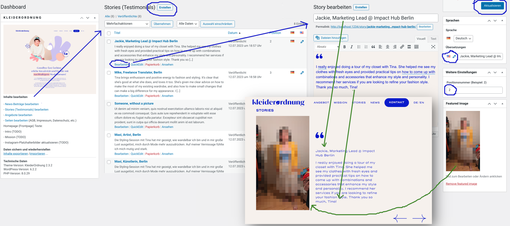
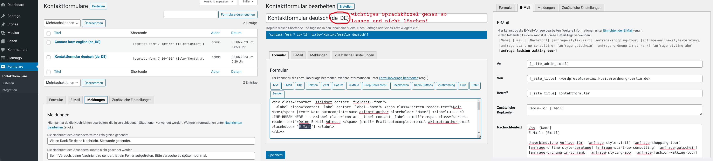

# KleiderOrdnung.Berlin

## Bedienungsanleitung für Webmaster

<ul>
<li><a href="#aktualisieren">Inhalte bearbeiten und aktualisieren</a>
  <ul>
    <li><a href="#news">News-Beiträge (Blog Posts)</a>
    <li><a href="#stories">Stories (Testimonials) und Angebote</a>
    <li><a href="#pages">Seiten (AGB, Datenschutz, Impressum, etc.)</a>
    <li><a href="#socialmedia">Social Media (Instagram)</a>
  </ul>
</li>
<li><a href="#kontakt">Kontaktformular / Posteingang</a></li>
<li><a href="#exportieren">Daten sichern (exportieren)</a></li>
<li><a href="#loeschen">Daten löschen (DSGVO)</a></li>
<li><a href="#updaten">WordPress aktualisieren</a></li>
</ul>

### Inhalte bearbeiten und aktualisieren

Bestimmte Inhalte können im Administrationsbereichs (WP-Admin) bearbeitet werden:
- Texte
- Angebote
- Stories (Testimonials)
- News
- Instagram-Platzhalter aktualisieren
- Fotos / Bilder (Mediathek)

Auf der Startseite (Dashboard) des Administrationsbereichs sind die Links zum Bearbeiten, zum Aktualisieren und zu dieser Anleitung zusammengefasst.

Die folgenden Screenshots zeigen beispielhaft, wo welche Daten verändert und veröffentlicht werden.

#### News-Beiträge (Blog Posts)

Auf der Startseite erscheinen immer die neusten 3 Beiträge der jeweiligen Sprache (deutsch oder englisch) mit Titel, Beitragsbild und Kategorie.

**Erstellen** anklicken, um einen neuen Beitrag zu verfassen, **Titel** und ggf. **Text** verfassen, ein **Beitragsbild** festlegen (öffnet die Mediathek mit der Möglichkeit, ein neues Bild hochzuladen oder ein bestehendes auszuwählen), eine **Kategorie** zuzuweisen (auch hier kann eine neue angelegt werden).

Schließlich auf **veröffentlichen** klicken...

... und dann durch anlicken des Plus-Zeichens neben der amerikanischen Flagge einen englische Version des gleichen Beitrags erstellen. Beitragsbild und passende Kategorie werden, wenn möglich, automatisch übernommen. Auch der englische Beitrag muss **veröffentlicht** werden.

In dieser Screenshot-Collage sind die verschiedenen Schritte zum erstellen und veröffentlichen mit blauen Pfeilen und Kreisen markiert. Die grünen Pfeile zeigen auf die entsprechenden Elemente, wie sie später auf der Homepage aussehen.

Bestehende Inhalte können zum Bearbeiten geöffnet und verändert werden. Anstelle des Veröffentlichen-Buttons gibt es dann einen blauen Button zum **aktualisieren**.

#### Stories (Testimonials) und Angebote

Auch andere Inhalte wie Stories (Testimonials) und Angebote lassen sich auf ähnliche Weise erstellen und verändern. Es gibt jeweils eine Übersichtsseite mit bestehenden Inhalten, Links zum bearbeiten und löschen, und einen Button zum **erstellen**.

Alles ist jeweils **mehrsprachig** angelegt, die Standardsprache ist deutsch, und Übersetzungen müssen separat erstellt und veröffentlicht werden. **Bilder** können hochgeladen oder aus der Mediathek ausgewählt werden.

Stories und Angebote haben zusätzlich ein Feld **Positionsnummer** um ihre Platzierung auf der Homepage zu bestimmen.

**Angebote** sind ein komplexer Beitragstyp. Außer den üblichen Elementen wie Überschrift, Beitragsbild und Freitext gibt es jeweils die Aufzählungsliste "Was Du erhältst" und einen Bereich mit Preisinformationen, außerdem eine Strichzeichnung (Icon) neben der Überschrift.

Das Layout richtet sich nach dem grafischen Design, somit wechselt die seitliche Anordnung von Text und Bild immer ab und kann nicht abweichend bestimmt werden. Entsprechend benötigt es etwas mehr Fantasie oder einen Klick auf **Vorschau**, um sich das Endergebnis vorzustellen.

Screenshot(s) (TODO)

**Weitere Angebote** sind ein Spezialfall der Angebote, die dreispaltig ohne Beitragsbilder angezeigt werden. Sie unterscheiden sich von den "großen" Angeboten nur dadurch, dass sie sich in der **Kategorie "Weitere Angebote"** befinden.

#### Seiten (AGB, Datenschutz, Impressum, etc.)

Im Gegensatz zu den oben beschriebenen Beiträgen haben **Seiten** keine vorgegebene Struktur. Hier kann mithilfe des Block-Editors frei getextet und gestaltet werden. Es ist auch möglich, vorformatierte Textpassagen aus anderen Dokumenten einzufügen.

Sprachen / Übersetzungen funktionieren genau wie bei den Beiträgen, also gibt es die Seite "Datenschutzerklärung" auch in einer englischen Version als "Privacy Statement".

Die Startseite (Homepage / Frontpage) ist ein Sonderfall und kann nicht unter "Seiten" bearbeitet werden.

Neue Seiten erscheinen nicht automatisch im Menü oder in der Fußzeile, sind aber öffentlich verfügbar und können beispielsweise als Landingpage für Event o.ä. verlinkt werden.

#### Social Media (Instagram)

Die neusten Bilder von Instagram werden mithilfe des Dienstes [juicer.io](https://www.juicer.io) eingebunden, allerdings erst sobald die Besucher:innen der Website einmalig zugestimmt haben, aktuelle Instagram-Inhalte zu laden. (Diese Lösung erspart uns unschöne Cookie-Banner oder juristische Abmahnungen.) Solange keine Zustimmung erteilt wurde, sind Platzhalter-Bilder zu sehen, die direkt auf unserem eigenen Server gespeichert sind und keine Interaktion mit Instagram auslösen. Deshalb sind sie aber auch nicht automatisch aktuell.

Die technisch einfachste Lösung wäre, alle Social-Media-Inhalte zusätzlich nochmal als Platzhalter auf der Homepage hochzuladen. Das erfordert aber regelmäßigen Pflegeaufwand. (TODO)

#### Posteingang / Flamingo-Adressbuch

Nachrichten sind unter Flamingo -> **Nachrichten-Eingang** (oder über den Link im Dashboard) zu sehen. Flamingo ist der Name des Plugins, das zusammen mit Contact Form 7 dafür sorgt, dass Nachrichten geprüft, versendet und gespeichert werden.

Zum Schutz vor Spam und digitalen Bedrohungen werden, falls vorhanden, das WordPress-Plugin Akismet und die Recaptcha-Technologie verwendet.

#### Kontaktformular bearbeiten

Nachrichten über das Kontaktformular werden per E-Mail zugestellt und sicherheitshalber zusätzlich im Administrationsbereich gesichert.

Beschriftung und ankreuzbare Anfrage-Interessen können unter **Formulare** -> **Kontaktformulare** bearbeitet werden. Zusätzliche Ankreuz-Optionen müssen sowohl im Formular als auch in der **E-Mail**-Vorlage gleichlautend hinzugefügt werden. Die bestehenden Optionen zeigen die richtige Schreibweise.

Im Reiter **Meldungen** können Bestätigungssätze und Fehlermeldungen umformuliert werden.

### Daten sichern (exportieren)

#### XML-Exportdatei

In einer einfachen Datensicherung (XML-Exportdatei) sind die aktuellen Textinhalte, eingegangene Kontaktformulare sowie manche Einstellungen enthalten. Die ist schnell und einfach unter **Werkzeuge** -> **Export** zu erstellen und herunterzuladen.

#### Backups und Archive

Zusätzliche können vollständige Backups bzw. Archive erstellt werden. Das ist aufwändiger und für eine einfache Website normalerweise nicht nötig, wenn Bilder und Videos zusätzlich noch an anderer Stelle gespeichert sind.

#### Personenbezogene Daten löschen

Im Menü **Werkzeuge** bietet WordPress eine Option zum Löschen personenbezogener Daten. Das kann nötig werden, wenn eine **Löschanfrage** im Sinne der Datenschutzgrundverordnung (DSGVO / GDPR) eingeht.

Sicherheitshalber sollten wir zusätzlich folgende Stellen prüfen und ggf. manuell die entsprechenden Daten löschen, unter anderem:
- Posteingang (Nachrichten-Eingang)
- Adressbuch (Flamingo-Adressbuch)
- Datensicherung (Backup / Export)
- Nennung von Personen als Kundin / Kunde / Testimonial

### WordPress aktualisieren

**Warum** aktualisieren? Sicherheitsupdates sind der wichtigste Grund.

**Wie** aktualisieren? Zunächst vergewissern, dass die Seite aktuell korrekt funktioniert. Wenn das der Fall ist, alle **Daten sichern** (exportieren), dann auf der **Seite "Aktualisierungen"** alle anstehenden Aktualisierungen auswählen und auf **"aktualisieren"** klicken.

**Nach** der Aktualisierung muss möglicherweise der Cache (Zwischenspeicher) geleert / aktualisiert werden, in den Einstellungen von W3Total Cache, siehe Link im Dashboard.

Der Zwischenspeicher wird nach der Leerung automatisch wieder gefüllt, sobald die jeweiligen Seiten erneut aufgerufen wurden. Messungen von Ladezeit und Verfügbarkeit können dadurch kurzzeitig beeinträchtigt werden.
